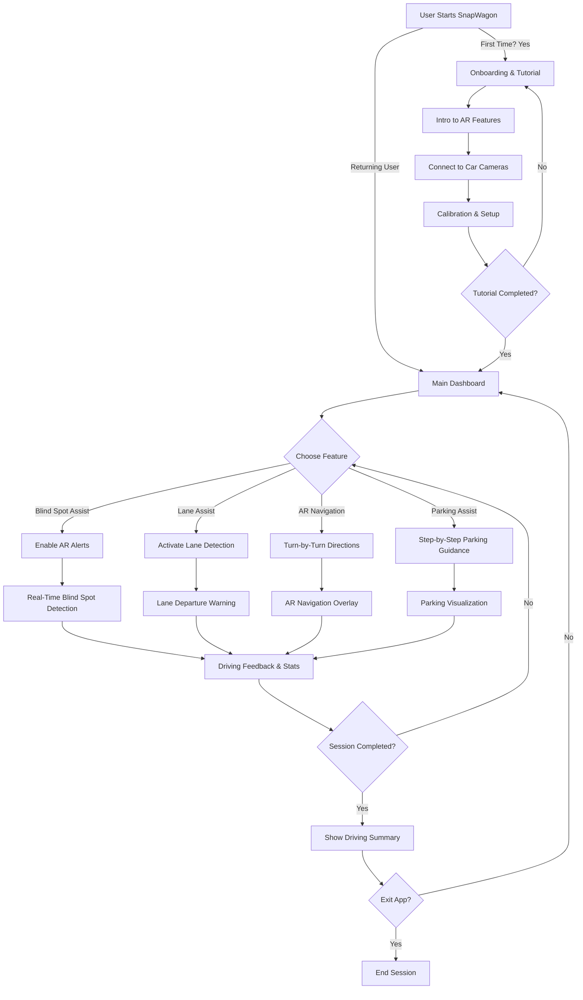
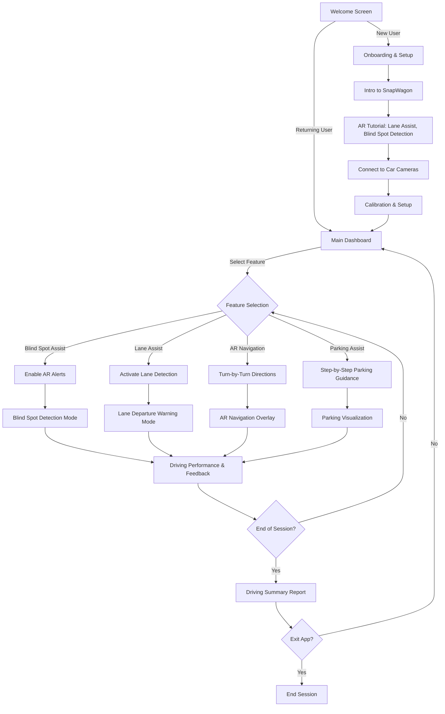

# SnapWagon

# SnapWagon – User Flow Diagram

## Overview
SnapWagon is an **AR-powered driver assist system** using Snapchat Spectacles. This user flow outlines the major steps, from the first launch to the core experience.

## **User Flow Diagram**
The following diagram represents the user's journey through SnapWagon:

## User Journey Breakdown

### 1. First-Time User
- User starts **SnapWagon** for the first time.  
- Walks through an **introductory AR tutorial**.  
- Connects to **car cameras via Wi-Fi/Bluetooth**.  
- Completes **calibration and setup**.  

### 2. Returning User
- User logs in and lands on the **Main Dashboard**.  
- Can select **AR features** such as:  
  - **Blind Spot Assist**  
  - **Lane Assist**  
  - **AR Navigation**  
  - **Parking Assist**  

### 3. AR Driving Assistance
- The Lens **detects vehicles, lane departures, stop signs**, and **projects AR alerts**.  
- **Real-time AR navigation overlays** guide the user.  
- Provides **audio warnings & haptic feedback**.  

### 4. End of Session
- The user receives a **driving performance report**.  
- Can choose to **restart** or **exit the session**.  

# SnapWagon – UI Structure Diagram

## Overview
This diagram represents the **UI flow and structure** of SnapWagon, outlining key screens and how users navigate through them.

## UI Structure Breakdown

### 1. Welcome Screen
- **New Users** → Onboarding, tutorial, and initial setup.  
- **Returning Users** → Go directly to the **Main Dashboard**.  

### 2. Onboarding & Setup
- **Intro to SnapWagon’s features**.  
- **Walkthrough of AR tutorials**.  
- **Connect to car cameras & perform calibration**.  

### 3. Main Dashboard
- Central hub for selecting **driving assistance features**:  
  - **Blind Spot Assist**  
  - **Lane Assist**  
  - **AR Navigation**  
  - **Parking Assist**  

### 4. Core Features
- **Blind Spot Detection Mode** → AR overlay alerts.  
- **Lane Departure Warning Mode** → Lane assist indicators.  
- **AR Navigation Overlay** → Turn-by-turn guidance.  
- **Parking Visualization** → Step-by-step parking assistance.  

### 5. Driving Feedback & End of Session
- User receives a **performance report**.  
- Option to **restart another session** or **exit the Lens**.  

# Lo-Fi Wireframes for SnapWagon's Key Screens

## Welcome Screen
- **SnapWagon logo**  
- Options for **Login** or **Guest Mode**  

## Main Dashboard
- **User Profile**  
- Central hub to select features:  
  - **Blind Spot Assist**  
  - **Lane Assist**  
  - **AR Navigation**  
  - **Parking Assist**  

## AR Feature Screen (Blind Spot Detection)
- **Live camera feed** from car  
- **AR overlay** showing detected vehicles in blind spots  
- **Warning alert** in case of close proximity  

## Driving Feedback Screen
- **Trip Summary**  
- **Score & badges earned**  
- Options to **restart session** or **exit**  

